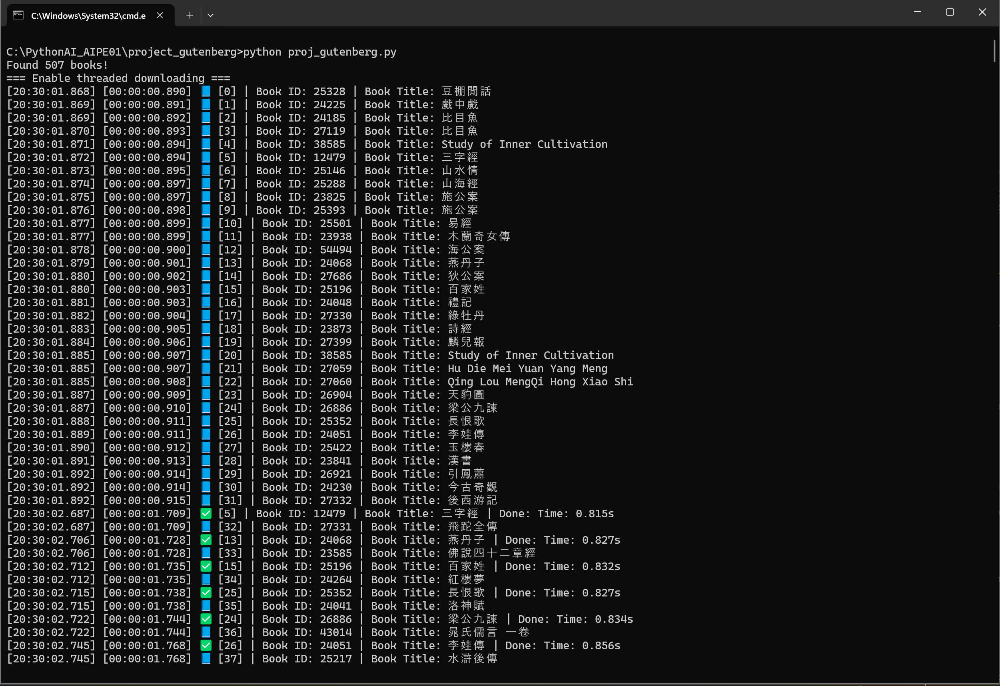
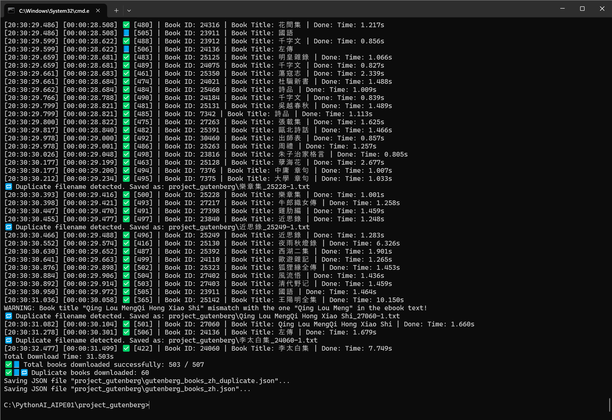

# Project Gutenberg Chinese Book Scraper/Downloader

Download Chinese language books from [Project Gutenberg](https://www.gutenberg.org/browse/languages/zh) using a threaded Python script with optional metadata filtering and structured JSON export.

## Features

- ✅ Multi-threaded book downloads (configurable thread count)
- ✅ Parses and extracts metadata (title, author, language, etc.)
- ✅ Optionally organizes books into folders by author
- ✅ Saves both raw and filtered book text (configurable)
- ✅ Filters and preserves only Chinese text content
- ✅ Detects and logs duplicate book downloads
- ✅ Exports metadata and download results as structured JSON
- ✅ Outputs a second JSON file listing duplicate book entries
- ✅ Thread-safe logging with queue-based design
- ✅ Logs each download with precise timestamps and duration
- ✅ Summarizes total download time across all books
  
## Python Version

Python 3.13.2

## Installation

```bash
git clone https://github.com/davidchanghk/proj_gutenberg.git
cd proj_gutenberg
python -m venv .venv
.venv\Scripts\active
pip install -r requirements.txt
```
> 💡 *Note: These steps are shown for Windows. Linux/macOS users should adjust the paths accordingly.*

## Usage

Run the script to start downloading Chinese books:

```bash
python proj_gutenberg.py
```

### Options (configured in script)

- `max_book_download`: Maximum number of books to download (default: 2000)
- `threadpool_enabled`: Enable/disable multi-threaded downloads
- `max_download_threads`: Number of concurrent download threads (default: 2 times of CPU count)
- `file_save_origin_content`: Save full original book text
- `json_save_filtered_content`: Include filtered text in final JSON

## Output

- Filtered book texts are saved to the `project_gutenberg` folder.
- A JSON file (`gutenberg_books_zh.json`) stores metadata and download info.

## Example JSON Output

```json
[
    {
        "index": 2,
        "title": "比目魚",
        "book_id": "24185",
        "link": "https://www.gutenberg.org/ebooks/24185",
        "info": {
            "url": "https://www.gutenberg.org/cache/epub/24185/pg24185.txt",
            "title": "比目魚",
            "author": "Aiyuezhuren",
            "lang": "Chinese",
            "producer": "Li Yi",
            "editor": null,
            "content": "... filtered Chinese-only text ..."
        }
    }
]
```
## Execution Snapshots

### Beginning of Multi-Threaded Downloading
The snapshot shows multiple threads started then the first download completes, and another another thread starts another download again.



### Duplicate/Mismatch title and download failure
This snapshot shows a scenario where the same book title appears multiple times or doesn't match the expected metadata, causing download failures or skipped entries.


### End of Multi-Threaded Downloading
Shows the completion of the multi-threaded download.
Duplicate book downloaded and gutenberg_books_zh_duplicate.json was created.



### Single Thread Download (Limited to 20 Books)
Snapshot of a single-threaded download operation capped at 20 books.
No duplicate download happened, and gutenberg_books_zh_duplicate.json wasn't created.


## Troubleshooting

- ❗ If you see "ConnectionError", ensure your internet is active.
- ❗ If duplicate files are generated, check `gutenberg_books_zh_duplicate.json` in the output folder.
- ❗ Some titles may mismatch due to encoding or metadata inconsistencies from Project Gutenberg.

## Coding Style

This project follows [PEP8](https://peps.python.org/pep-0008/) guidelines except below.
- Doesn't limit all lines to a maximum of 79 characters.

## Author

- Hsiao-Kang Chang aka David Chang 
- GitHub: https://github.com/davidchanghk

## Contact

For questions, suggestions, or issues, please open an [issue](https://github.com/davidchanghk/proj_gutenberg/issues).
> 💬 *GitHub does not support private messaging. Please use the issue tracker to get in touch.*

## Copyright

Copyright (c) 2025 Hsiao-Kang Chang. All rights reserved.